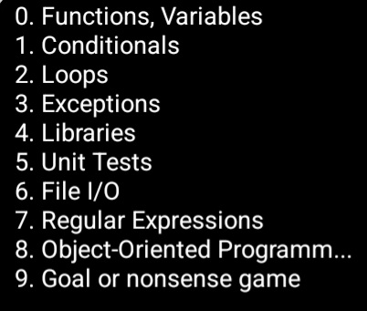
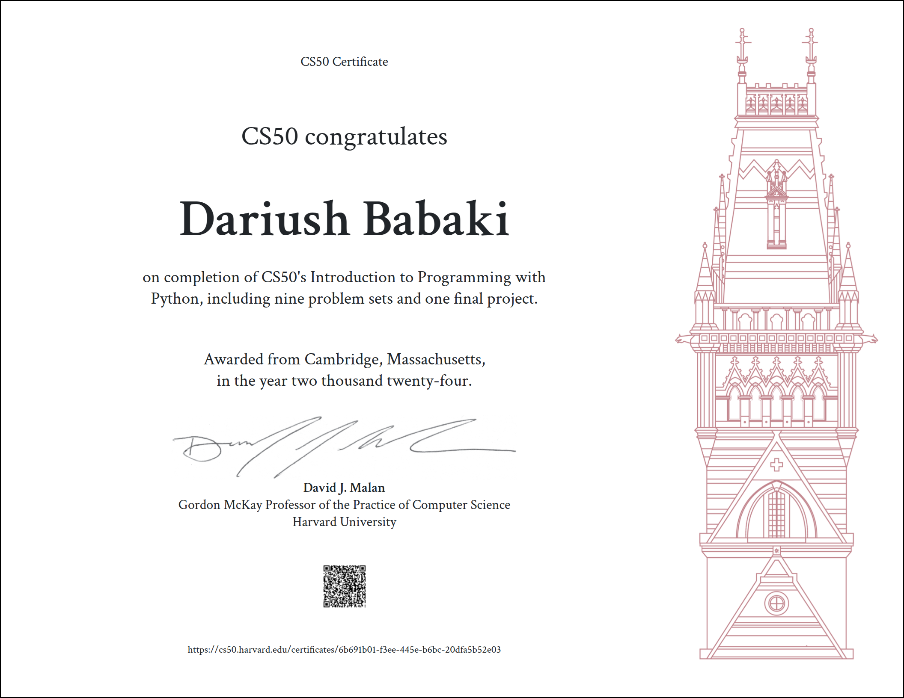

Harvard CS50p — 2024 Solutions
=====================

-   [Course Link](https://cs50.harvard.edu/python/2022/)
-   [My Certificate](https://cs50.harvard.edu/certificates/6b691b01-f3ee-445e-b6bc-20dfa5b52e03)
-   [Final Project](https://github.com/dariushbabaki/CS50-Python/tree/main/final%20project)

## What is it?

An introduction to programming using a language called Python. Learn how to read and write code as well as how to test and “debug” it. Designed for students with or without prior programming experience who’d like to learn Python specifically.

-   ✅ Videos
-   ✅ Lab & Problem Set & Final Project
-   ✅ Slides & Notes
-   ✅ Auto Grader

## Works

This repository is used to store my solutions to weekly assignments. You can click on the folder to see a detailed description of weekly assignments and my achievement.

> A quick word on [Academic Honesty](https://cs50.harvard.edu/x/2024/honesty/). While these solutions will help you to get through the course without too much effort, you should do your best to figure out a working solution yourself before taking a look at any of my solutions. Investing your time and energy into solving the problem sets yourself is in my opinion the only way to eventual mastery.
Go ahead and take a peek at the solutions.

## Table of Contents
- [Problem Set 0: Functions, Variables](https://github.com/dariushbabaki/CS50-Python/tree/main/week0)
  * [Einstein](https://github.com/dariushbabaki/CS50-Python/blob/main/week0/einstein.py)
  * [Faces](https://github.com/dariushbabaki/CS50-Python/blob/main/week0/faces.py)
  * [Indoor](https://github.com/dariushbabaki/CS50-Python/blob/main/week0/indoor.py)
  * [Playback](https://github.com/dariushbabaki/CS50-Python/blob/main/week0/playback.py)
  * [Tip](https://github.com/dariushbabaki/CS50-Python/blob/main/week0/Tip.py)
 - [Problem Set 1: Conditionals](https://github.com/dariushbabaki/CS50-Python/tree/main/week1)
  * [Deep Thought](https://github.com/dariushbabaki/CS50-Python/blob/main/week1/deep.py)
  * [Home Federal Savings Bank](https://github.com/dariushbabaki/CS50-Python/blob/main/week1/bank.py)
  * [File Extensions](https://github.com/dariushbabaki/CS50-Python/blob/main/week1/extensions.py)
  * [Math Interpreter](https://github.com/dariushbabaki/CS50-Python/blob/main/week1/interpreter.py)
  * [Meal Time](https://github.com/dariushbabaki/CS50-Python/blob/main/week1/meal.py)
 - [Problem Set 2: Loops](https://github.com/dariushbabaki/CS50-Python/tree/main/week2)
  * [camelCase](https://github.com/dariushbabaki/CS50-Python/blob/main/week2/camel.py)
  * [Coke Machine](https://github.com/dariushbabaki/CS50-Python/blob/main/week2/coke.py)
  * [Just setting up my twttr](https://github.com/dariushbabaki/CS50-Python/blob/main/week2/twttr.py)
  * [Vanity Plates](https://github.com/dariushbabaki/CS50-Python/blob/main/week2/plates.py)
  * [Nutrition Facts](https://github.com/dariushbabaki/CS50-Python/blob/main/week2/nutrition.py)
   - [Problem Set 3: Exceptions](https://github.com/dariushbabaki/CS50-Python/tree/main/week3)
  * [Fuel Gauge](/Week3/fuel)
  * [Felipe’s Taqueria](/Week3/taqueria)
  * [Grocery List](/Week3/grocery)
  * [Outdated](/Week3/Outdated)
   - [Problem Set 4: Libraries](/Week4)
  * [Emojize](/Week4/Emojize)
  * [Frank, Ian and Glen’s Letters](/Week4/figlet)
  * [Adieu, Adieu](/Week4/adieu)
  * [Guessing Game](/Week4/game)
  * [Little Professor](/Week4/professor)
  * [Bitcoin Price Index](/Week4/bitcoin)
   - [Problem Set 5: Unit Tests](/Week5)
  * [Testing my twittr](/Week5/test_twttr)
  * [Back to the Bank](/Week5/test_bank)
  * [Re-requesting a Vanity Plate](/Week5/test_plates)
  * [Refueling](/Week5/test_fuel)
   - [Problem Set 6: File I/O](/Week6)
  * [Lines of Code](/Week6/lines)
  * [Pizza Py](/Week6/pizza)
  * [Scourgify](/Week6/scourgify)
  * [CS50 P-Shirt](/Week6/shirt)
   - [Problem Set 7: Regular Expressions](/Week7)
  * [NUMB3RS](/Week7/numb3rs)
  * [Watch on YouTube](/Week7/watch)
  * [Working 9 to 5](/Week7/working)
  * [Regular, um, Expressions](/Week7/um)
  * [Response Validation](/Week7/response)
   - [Problem Set 8: Object-Oriented Programming](/Week8)
  * [Seasons of Love](/Week8/seasons)
  * [Cookie Jar](/Week8/jar)
  * [CS50 Shirtificate](/Week8/shirtificate)
- [Problem Set9]
  * [Final Project](https://github.com/dariushbabaki/CS50-Python/tree/main/final%20project)

I finished this course on February 6, 2024.
The picture below shows my certificate after completing all the assignments:

